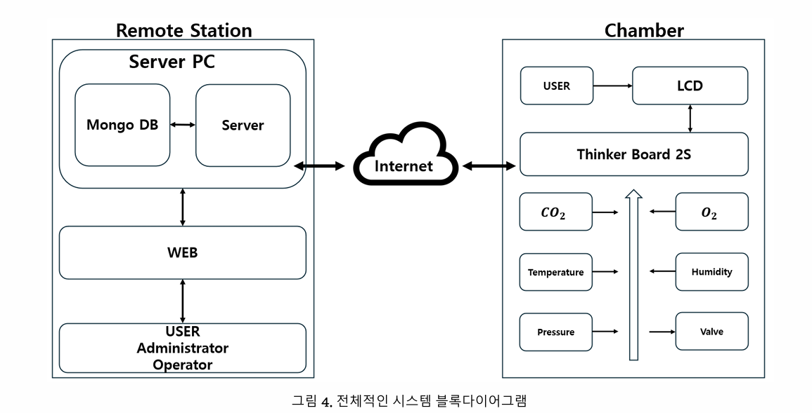

# 고압산소챔버 IoT 모니터링 시스템

<div align="center">


**Tinker Board 2S 기반 고압산소챔버 실시간 모니터링 및 제어 시스템**

</div>

---

## 📋 개요

Tinker Board 2S IoT 디바이스를 활용한 고압산소챔버 원격 모니터링 및 제어 플랫폼입니다.  
Android 앱이 Tinker Board 2S에서 직접 실행되며 하드웨어를 제어하고, WebSocket을 통해  
원격 서버와 실시간 데이터를 주고받습니다.

---

## 🏗️ 시스템 아키텍처



```
┌─────────────────────────────────┐         ┌─────────────────────────────────────┐
│         Remote Station          │         │               Chamber               │
│  ┌──────────────────────────┐   │         │   ┌─────────────────────────────┐   │
│  │        Server PC         │   │         │   │       Tinker Board 2S        │   │
│  │  ┌──────────┐ ┌───────┐  │   │         │   │   (Android App 실행)         │   │
│  │  │ MongoDB  │◀▶ NestJS│  │◀──┼Internet─┼──▶│                             │   │
│  │  └──────────┘ └───────┘  │   │         │   │  SPI/UART/GPIO/I2C 제어      │   │
│  └──────────────────────────┘   │         │   └──────────────┬──────────────┘   │
│            ▲                    │         │          ▲       │                  │
│            │                    │         │          │       ▼                  │
│  ┌─────────┴────────────────┐   │         │  ┌───────┴──────────────────────┐  │
│  │     Vue 3 Web 대시보드    │   │         │  │  CO₂ / O₂ / Temp / Humidity  │  │
│  └──────────────────────────┘   │         │  │  Pressure / Valve / LED       │  │
│            ▲                    │         │  └──────────────────────────────┘  │
│            │                    │         └─────────────────────────────────────┘
│  ┌─────────┴──────────────┐     │
│  │ User/Admin/Operator    │     │
│  └────────────────────────┘     │
└─────────────────────────────────┘
```

---

## ✨ 주요 기능

| 기능 | 설명 |
|------|------|
| 📡 실시간 센서 모니터링 | 압력, 온도, 습도, O₂, CO₂, 유량을 1초 주기로 수집 |
| 🎛️ PID 자동 압력 제어 | 2채널 PID로 가압/감압 비례밸브 정밀 제어 |
| 📊 라이브 차트 | 목표 프로파일(검정)과 실측 압력(빨강) 실시간 비교 |
| 🔐 JWT 인증 | 사용자/관리자/운영자 역할 기반 접근 제어 |
| ✏️ 압력 프로파일 편집 | 구간별 시작압력·종료압력·지속시간 설정 |
| 💾 세션 이력 저장 | MongoDB에 세션별 센서 데이터 영구 보관 |
| 🖥️ 웹 원격 모니터링 | Vue 3 대시보드로 원격지에서 실시간 상태 확인 |
| 🐳 자동화 배포 | Docker / PM2 / Kubernetes(K3s) 지원 |

---

## 🛠️ 기술 스택

### Android App (Tinker Board 2S에서 실행)

| 분류 | 기술 |
|------|------|
| Platform | Android API 30+ (minSdk 30) |
| Architecture | MVVM (ViewModel + LiveData + Repository) |
| 네트워킹 | Retrofit2 + OkHttp4 (REST), Socket.IO 2.1.0 (WebSocket) |
| 하드웨어 | MRAA 2.2.0 (GPIO/SPI/I2C/UART) |
| 차트 | MPAndroidChart v3.1.0 |
| 인증 | Auth0 JWT Decode 2.0.0 |
| UI | Material Design 3, ConstraintLayout, View Binding |
| 백그라운드 | Bound Services (GpioService, SensorService, ValveService, WebSocketService) |

### Backend (Remote Server)

| 분류 | 기술 |
|------|------|
| Framework | NestJS 10 (Fastify adapter) |
| Database | MongoDB + Mongoose 8 |
| Real-time | Socket.IO 4 (WebSocket) |
| Auth | JWT + Passport + bcrypt |
| Monitoring | Prometheus (`/metrics`) |
| Logging | Winston |
| Docs | Swagger (OpenAPI) |

### Frontend (Web Dashboard)

| 분류 | 기술 |
|------|------|
| Framework | Vue 3.5 + Vue Router 4 + Pinia 2 |
| Charts | ECharts 5 / Chart.js 3 |
| Real-time | Socket.IO Client 4 |
| i18n | vue-i18n 9 |

### 인프라

| 분류 | 기술 |
|------|------|
| Container | Docker + Nginx |
| Process | PM2 |
| Orchestration | K3s (Kubernetes) + Helm |

---

## 📁 저장소 구조

```
tinkerboard-test/          # 서버 & 웹 레포 (현재)
├── boilerplate/
│   ├── backend/           # NestJS 백엔드
│   │   └── src/
│   │       ├── auth/           # JWT 인증
│   │       ├── user/           # 사용자 관리
│   │       ├── pressure-profile/ # 압력 프로파일 CRUD
│   │       ├── ws/             # WebSocket 게이트웨이
│   │       ├── health-check/
│   │       └── core/           # 공통 유틸 (로깅, 미들웨어)
│   └── frontend/          # Vue 3 웹 대시보드
│       └── src/
│           ├── components/
│           │   ├── Charts/     # 실시간 차트
│           │   └── Cards/      # 통계 카드
│           └── views/
├── script/                # 배포 자동화 스크립트
│   ├── backend.sh         # 백엔드 PM2 배포
│   ├── frontend.sh        # 프론트엔드 Docker 배포
│   └── docker.sh          # Docker ARM 설치
└── document/              # 설치 및 운영 가이드

HbotChamberApp/            # Android 앱 레포 (별도)
└── app/src/main/java/.../
    ├── Activity/          # LoginActivity, MenuActivity, RunActivity,
    │                      # EditActivity, IoPortActivity
    ├── Service/           # GpioService, SensorService, ValveService,
    │                      # WebSocketService, PidService
    ├── Controller/        # Pid, Max1032, Co2Sensor, PinController, Ad5420
    ├── ViewModel/         # RunViewModel, IoPortViewModel
    ├── repository/        # PIDRepository, SensorRepository, ProfileRepository
    └── network/           # ApiService, SensorWebSocketListener
```

---

## 📱 Android 앱 화면 구성

### 1. Login
- 오프라인 모드 (로컬 admin) 및 서버 JWT 인증 지원
- 토큰 및 사용자 정보 SharedPreferences 저장

### 2. Menu
앱 시작 시 4개 서비스 자동 초기화:
- `GpioService` — GPIO 핀 제어 (MRAA)
- `SensorService` — SPI ADC + UART 센서 읽기 (1초 주기)
- `ValveService` — 비례밸브 / 솔레노이드밸브 제어
- `WebSocketService` — 서버 실시간 동기화

### 3. Run (치료 실행)
- 목표 프로파일 vs 실측 압력 듀얼 라이브 차트
- 현재값 표시: Set Point, 압력, O₂, CO₂, 온도, 습도, 경과시간
- 제어 버튼: RUN / PAUSE / RESUME / STOP

### 4. Edit (프로파일 편집)
- 구간별 시작압력·종료압력·지속시간 설정
- 프로파일 시각화 차트 연동
- JSON 로컬 저장 + 서버 WebSocket 동기화

### 5. IoPort (하드웨어 직접 제어)
- 실시간 센서 6종 모니터링
- 솔레노이드 밸브 8채널 ON/OFF
- 비례밸브 2채널 UP/DOWN (4~20mA 전류 출력)
- 디지털 LED 3채널 / 디지털 입력 8비트 상태 표시

---

## 🔩 하드웨어 인터페이스

| 인터페이스 | 소자 | 역할 |
|-----------|------|------|
| SPI | MAX1032 ADC | 온도·습도·유량·압력·O₂ (4-20mA 아날로그 입력) |
| UART | SprintIR-WX-100 | CO₂ 농도 측정 (NDIR, 0~5000 PPM) |
| SPI | AD5420 DAC | 비례밸브 2채널 전류 출력 (4-20mA) |
| I2C | MCP23017 | 솔레노이드 8채널 + 디지털 입력 8비트 |
| GPIO | MRAA | LED 3채널, 밸브 Enable 핀 |

### 센서 측정 범위

| 센서 | 범위 |
|------|------|
| 압력 | 1.0 ~ 3.5 ATA |
| 온도 | -30 ~ +100 °C |
| 습도 | 0 ~ 100 % |
| 산소 (O₂) | 0 ~ 100 % |
| 이산화탄소 (CO₂) | 0 ~ 5000 PPM |
| 유량 | 4 ~ 20 mA 스케일링 |

---

## ⚙️ PID 제어

가압·감압 2채널 독립 PID 제어기:

```
P = 15.0 / I = 10.0 / D = 0.1
```

| 항목 | 측정값 | 기준값 |
|------|--------|--------|
| 가압 속도 | 0.028 MPa/min | ≤ 0.078 MPa/min |
| 감압 속도 | 0.0446 MPa/min | ≤ 0.078 MPa/min |
| 3.02 ATA 오버슈트 | 0.67% | — |
| 지속 압력 오차 | ±0.02 ATA | — |

---

## 📡 WebSocket 이벤트

| 이벤트 | 방향 | 설명 |
|--------|------|------|
| `sensor_data` | Android → Server → Web | 1초 주기 센서 데이터 브로드캐스트 |
| `client_command` | Web → Server → Android | start / pause / resume / stop 명령 |

### 센서 데이터 페이로드

```json
{
  "deviceId": "string",
  "sessionId": "string",
  "userId": "string",
  "pressure": 1.8,
  "temperature": 36.5,
  "humidity": 45.0,
  "o2Level": 21.0,
  "co2Level": 420,
  "flowRate": 5.0,
  "elapsedTime": 120,
  "setPoint": 2.0
}
```

---

## 🔌 API 엔드포인트

Swagger 문서: `http://<server>:8080/api`

| 메서드 | 경로 | 설명 |
|--------|------|------|
| POST | `/auth/login` | 로그인 (JWT 발급) |
| GET/POST | `/user` | 사용자 조회/생성 |
| GET/POST/PATCH/DELETE | `/pressure-profile` | 압력 프로파일 관리 |
| GET | `/health` | 헬스 체크 |
| GET | `/metrics` | Prometheus 메트릭 |

---

## 🚀 서버 배포

### 사전 요구사항
- Node.js 18+, MongoDB, Docker, PM2

### 백엔드

```bash
cd boilerplate/backend
npm install
npm run start:dev    # 개발
npm run build && npm run start:prod  # 프로덕션
```

### 프론트엔드

```bash
cd boilerplate/frontend
npm install
npm run dev          # 개발
npm run build        # 빌드
```

### 스크립트 자동 배포

```bash
bash script/backend.sh     # 백엔드 (PM2)
bash script/frontend.sh    # 프론트엔드 (Docker, port 3000)
```

---

## 📚 문서

자세한 설치 및 운영 가이드는 `document/` 디렉토리를 참고하세요.

| 문서 | 내용 |
|------|------|
| 설치 가이드 | Tinker Board 2S 환경 설정 |
| Docker 설정 | ARM Docker 설치 및 컨테이너 운영 |
| K3s / Kubernetes | 경량 쿠버네티스 구성 |
| Helm Chart | 서비스 배포 자동화 |
| PM2 | 프로세스 관리 |
| 방화벽 | 포트 및 네트워크 설정 |

---

## 🔗 관련 저장소

- **Android 앱**: [HbotChamberApp](https://github.com/bromine1997/HbotChamberApp) — Tinker Board 2S에서 실행되는 하드웨어 제어 앱

---

## 📄 라이선스

MIT License
